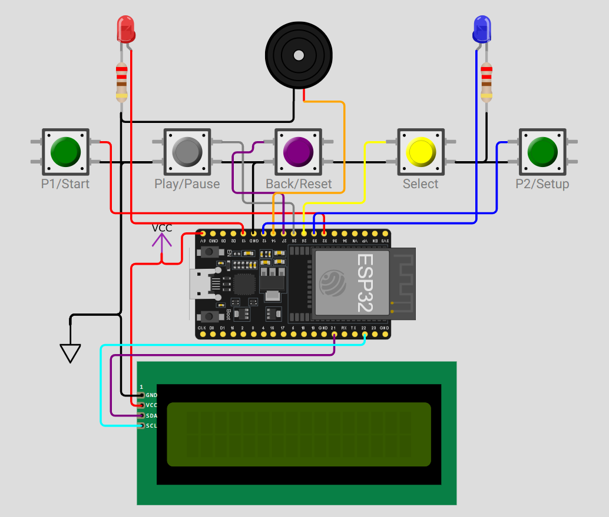

# ESP32 Smart Chess Clock ♟️⏲️

A highly customizable, feature-rich Chess Clock built using an ESP32 microcontroller and a 16x2 I2C LCD display. Designed for both tournament and casual play, it features precision time tracking, Fischer increments, move counting, and an intuitive on-device menu system.

## 🌟 Key Features
* **Custom Time Controls:** Adjustable minutes, seconds, and Fischer increment settings directly from the device.
* **Dual-Mode Display:** Toggle between viewing the remaining time and the current move count during live play.
* **Smart Audio/Visual Feedback:** Configurable sound alerts (player toggle beeps, 10-second warning ticks, timeout alarms) and active-player LED indicators.
* **Arbiter Functions:** Built-in pause functionality and a dedicated manual "Draw" declaration system.
* **Efficient UI:** A debounced 5-button interface with contextual mapping (buttons perform different actions depending on the active screen).

## 🧰 Hardware Requirements
* 1x ESP32 Development Board
* 1x 16x2 LCD Display with I2C Backpack
* 5x Push Buttons (Momentary)
* 1x Blue LED (Player 1) & 1x Red LED (Player 2)
* 2x 220Ω Resistors (for LEDs)
* 1x Buzzer (Active or Passive)
* Breadboard / Custom Power Rail and Jumper Wires

## 🔌 Wiring & Schematic

| Component | ESP32 Pin | Component | ESP32 Pin |
| :--- | :--- | :--- | :--- |
| **LCD SDA** | GPIO 21 | **Button 4 (Pause)**| GPIO 26 |
| **LCD SCL** | GPIO 22 | **Button 5 (Back)** | GPIO 27 |
| **Button 1 (P1)** | GPIO 32 | **Blue LED (P1)** | GPIO 13 |
| **Button 2 (P2)** | GPIO 33 | **Red LED (P2)** | GPIO 12 |
| **Button 3 (Select)**| GPIO 25 | **Buzzer** | GPIO 14 |
*(Note: All buttons use internal pull-ups and should be wired to GND).*

## 📂 Project Documentation
For a complete, step-by-step breakdown of how to build and operate this project, please refer to the included documentation file:
👉 **[ESP32_Chess_Clock_Documentation.docx](./docs/ESP32_Chess_Clock_Documentation.docx)**

## 🛠️ Quick Start (Software)
1. Clone or download this repository.
2. Open the `.ino` file located in the `chess-clock-esp32` folder using the Arduino IDE.
3. Ensure you have the ESP32 board manager installed.
4. Install the **LiquidCrystal I2C** library (by Frank de Brabander) via the Arduino Library Manager.
5. Compile and upload to your ESP32 board.

## 🤝 Contributing
Feel free to fork this project, submit pull requests, or open issues if you find bugs or want to suggest new features!

## 📜 License
This project is licensed under the MIT License - see the [LICENSE](LICENSE) file for details.
